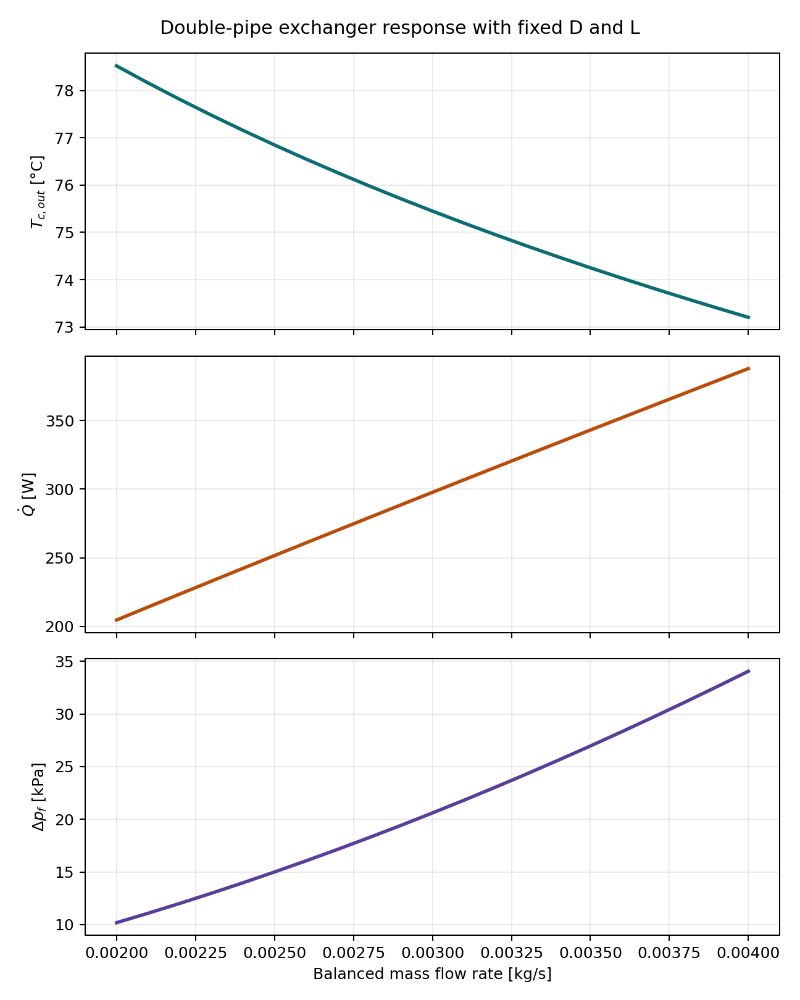
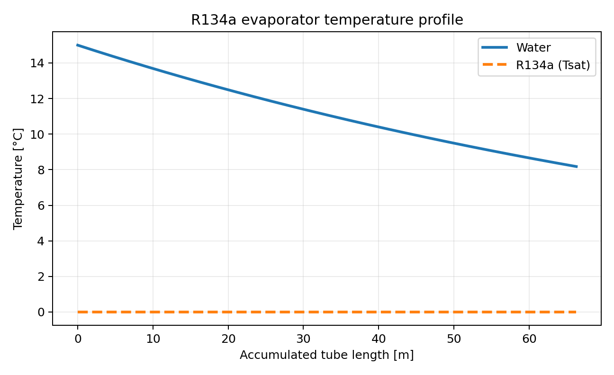

# Computational Thermofluids: Heat Exchanger and Boiler Modeling

Computational thermofluids portfolio from Universidad de los Andes. This
repository combines heat-exchanger sizing, pressure-drop analysis,
thermophysical-property evaluation with CoolProp, radiation modeling, and a
fire-tube boiler model.



## Project Abstract

The featured workflow designs and evaluates thermal systems using first-law
balances, logarithmic-mean temperature difference (LMTD), effectiveness-NTU
reasoning, internal-flow correlations, Darcy pressure loss, and nonlinear
root-finding. A separate laboratory notebook models a fire-tube boiler using
combustion balances, heat-transfer coefficients, radiation, and editable
nominal geometry.

## Engineering Objectives

- Size shell-and-tube and double-pipe heat exchangers.
- Evaluate convection coefficients from Reynolds, Prandtl, and Nusselt numbers.
- Enforce pressure-drop constraints during exchanger design.
- Use CoolProp for reproducible thermophysical-property calculations.
- Document the modeling assumptions behind a fire-tube boiler laboratory model.
- Preserve EES, notebook, and report artifacts as course evidence.

## Mathematical Formulation

The heat-transfer calculations use

```math
\dot Q = UA\Delta T_{lm}
```

```math
\Delta T_{lm} =
\frac{\Delta T_1-\Delta T_2}
{\ln(\Delta T_1/\Delta T_2)}
```

and the Darcy pressure-loss relation

```math
\Delta p = f\frac{L}{D}\frac{\rho V^2}{2}.
```

See [Mathematical Formulation](docs/mathematical-formulation.md) for the full
methodology and assumptions.

## Assumptions

- Fluid properties are evaluated from CoolProp at representative bulk states.
- Tube-wall fouling is neglected in the portable heat-exchanger workflow.
- Transitional flow correlations are smoothly interpolated.
- The boiler model uses methane-equivalent fuel and editable nominal geometry.
- Historical EES and notebook files are preserved as supporting evidence.

## Methodology

1. Solve energy balances for each exchanger case.
2. Evaluate thermophysical properties and dimensionless groups.
3. Calculate convection coefficients and overall conductance.
4. Solve required area, tube length, and pressure-drop constraints.
5. Perform a mass-flow sensitivity sweep.
6. Export numerical summaries and publication-quality figures.

## Results

Run the reproducible workflow to generate:

- `results/heat_exchanger_summary.json`
- `results/double_pipe_sensitivity.csv`
- `figures/evaporator_temperature_profile.png`
- `figures/heat_exchanger_parametric.png`



## Discussion

The repository demonstrates thermofluids reasoning beyond formula
substitution. The design workflow couples heat duty, fluid properties,
dimensionless correlations, geometric sizing, and pressure loss through
nonlinear solvers. The boiler notebook extends the portfolio into combustion
and radiation modeling.

## Repository Structure

```text
data/        Laboratory source data and EES exports
docs/        GitHub Pages-ready technical documentation
figures/     Generated publication-quality plots
labs/        Fire-tube boiler laboratory model
notebooks/   Course notebooks
reports/     Selected reports, EES files, and coursework artifacts
results/     Generated numerical summaries
scripts/     Reproducibility entry points
src/         Reusable Python package
tests/       Lightweight regression tests
```

## Installation

```bash
python3 -m venv .venv
source .venv/bin/activate
python -m pip install -r requirements.txt
```

## Reproducibility

```bash
python scripts/generate_results.py
python -m unittest discover -s tests -v
```

See the [Reproducibility Guide](docs/reproducibility.md) for details.

## Future Work

- Calibrate the boiler model against measured ML-041 laboratory data.
- Add uncertainty propagation for geometry and heat-transfer coefficients.
- Compare exchanger alternatives using lifecycle cost and exergy metrics.
- Integrate CAD-derived exchanger geometry into the sizing workflow.

## References

- F. P. Incropera et al., *Fundamentals of Heat and Mass Transfer*, Wiley.
- Y. A. Çengel and A. J. Ghajar, *Heat and Mass Transfer*, McGraw-Hill.
- [CoolProp documentation](https://coolprop.org/)

## Documentation

Start with the [GitHub Pages-ready documentation](docs/index.md) and the
[portfolio evaluation](docs/portfolio-evaluation.md).
